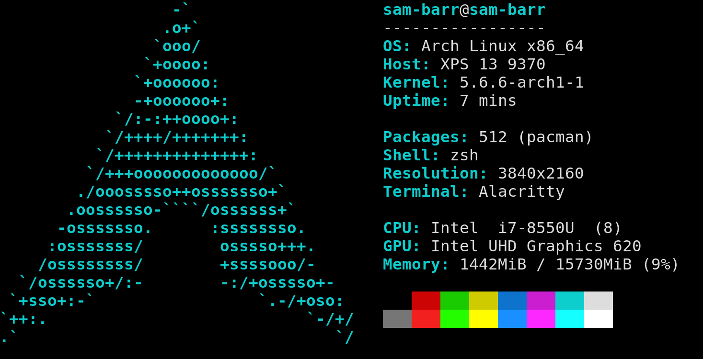

paleofetch
==========

Like neofetch, but incomplete, written in ~400 lines of C instead of 10,000 lines of bash,
and runs a lot faster. Currently it only supports Arch Linux with X running. 

Example output:

Compiling
---------

    make install

FAQ
---

Q: Do you really run neofetch every time you open a terminal?  
A: Yes, I like the way it looks and like that it causes my prompt to start midway
down the screen. I do acknowledge that the information it presents is not actually useful.
